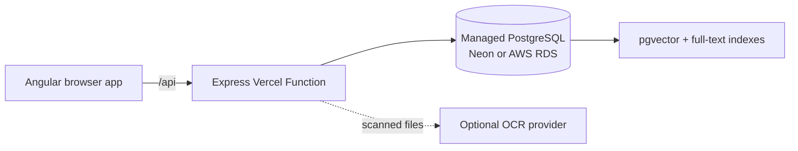

# Hackathon Framework

A clean, highly opinionated Angular + Express starter for document-grounded hackathon products. It deploys as one Vercel project and uses managed PostgreSQL with pgvector as the durable source of truth. Neon is a low-friction option for hobby projects and demos; AWS RDS remains a good fit when the deployment needs dedicated infrastructure and network control.

## Included

- Angular 21 standalone frontend with a minimal left navigation: Dashboard, Query, Results, and Library
- Chat-style Query page with a bottom composer and source citations
- Read-only Decision Console with persisted, observable retrieval and response-policy events
- Durable, resumable conversation sessions on the Results page
- Nested Library folders with breadcrumb navigation and folder-aware uploads
- Small-file upload with visible ingestion, OCR, summarization, chunking, and vectorization states
- Express API packaged as a Vercel Function under `/api`
- Selectable disabled, local email/password, or Auth0 authentication
- Workspace-scoped activity log for record creation and local authentication events
- PostgreSQL migrations with workspace scoping, full-text search, `vector(1024)`, and HNSW indexing
- Dependency-free feature-hash embeddings, so retrieval works before an external embedding provider is added
- Optional Claude OCR for scanned PDFs and images

## Benefits

### Fast to turn into a challenge-specific product

- The browser, API, database, retrieval system, authentication, and deployment configuration already work together, leaving teams to focus on the challenge flow.
- Angular and Express live in one pnpm workspace with shared TypeScript contracts, so frontend and API changes stay aligned.
- The code uses conventional routes, repositories, and small services that are straightforward to inspect, replace, or delete when creating a derivative repository.
- Dashboard, Query, Results, and Library provide a usable baseline without forcing every child application to keep every page.
- Branding, navigation, retrieval, generation, extraction, embeddings, logging, and schema each have an obvious customization point.
- The MIT license permits straightforward reuse across independent challenge repositories.

### Useful before every external integration is configured

- Text-bearing files can be extracted, summarized, chunked, embedded, indexed, and searched without an external AI key.
- Dependency-free feature-hash embeddings and deterministic summaries provide a functional local fallback while preserving the same database and API contracts used by model-backed implementations.
- Small raw files can live in PostgreSQL initially, avoiding an object-storage dependency during a hackathon.
- Optional capabilities degrade visibly: scanned files wait in `needs_ocr`, failed processing is retryable, and unavailable Bedrock generation returns retrieved evidence instead of an invented answer.
- Health checks, ingestion states, error messages, and the Decision Console make incomplete configuration and runtime behavior easier to diagnose.

### Grounded AI behavior by default

- A lightweight Bedrock model converts the question into a structured retrieval plan before the primary model is used, separating inexpensive query analysis from answer generation.
- Hybrid pgvector and PostgreSQL full-text retrieval combines semantic similarity with exact term matching, including additional ranking for monetary questions.
- Retrieval is workspace-scoped, context is bounded, and passages are labeled before being sent to the model.
- Answers preserve source citations and readable Markdown, while original documents can be previewed from the Library.
- If no relevant corpus evidence is found, the generation call is skipped. This reduces cost and prevents unsupported corpus answers.
- The draggable Decision Console exposes observable retrieval and policy decisions without claiming to reveal private model reasoning, while allowing users to choose how much screen space diagnostics receive.

### Durable data and practical operations

- Conversations and messages are stored durably, can be resumed from Results, and can be deleted with their dependent data.
- Nested, alphabetized Library folders support breadcrumbs, folder-aware uploads, previews, and recursive deletion.
- PostgreSQL provides one durable source of truth for documents, chunks, vectors, conversations, folders, authentication, and activity history.
- Explicit, transactional migrations avoid hidden schema changes during application startup or Vercel builds.
- HNSW vector and GIN full-text indexes provide a credible retrieval foundation that can grow beyond a demo corpus.
- Transaction-aware activity logging keeps record creation and its audit entry consistent.

### Secure and deployable baseline

- Authentication can remain off for rapid prototyping, use self-contained local registration, or switch to Auth0 without changing application routes.
- Authenticated users receive isolated workspaces derived from verified identities; caller-supplied workspace headers are ignored in authenticated modes.
- Local registration, login success, failed login, and logout are auditable without recording passwords, tokens, cookies, or raw failed-login emails.
- Raw document previews use restrictive response headers, while upload size limits and workspace checks are enforced by the API.
- The Angular application and Express API deploy as one same-origin Vercel project, reducing deployment and CORS complexity.
- The Vercel function is region-pinned near the intended database deployment, and database pooling is configurable for serverless limits.
- The responsive desktop/mobile shell, loading states, retry paths, and readable error responses provide a presentable starting UX.
- The README identifies the deliberate production boundaries—object storage, queues, malware scanning, quotas, and broader tests—so prototype shortcuts are explicit rather than hidden.

## Architecture



The starter deliberately keeps the first deployment small:

- Raw files up to 4 MB are stored in PostgreSQL `bytea`, which stays under Vercel's request-body ceiling and avoids adding object storage to the baseline.
- Text, Markdown, CSV, JSON, HTML, and text-bearing PDFs process without an AI key.
- Scanned PDFs and images move to `needs_ocr` until `ANTHROPIC_API_KEY` is configured.
- Summaries are deterministic and embeddings use local feature hashing. Replace these services with challenge-specific models without changing the database or API contracts.

For each query, the configured lightweight Bedrock model creates a structured retrieval plan. The API uses that plan to retrieve ready workspace-scoped chunks, bounds and labels the full source passages, and sends that context with the user's question to the primary Bedrock model. No relevant chunks means no generation call.

For a production-sized corpus, move raw objects to S3 or Vercel Blob, upload directly with signed URLs, and keep only metadata, extracted text, chunks, and vectors in PostgreSQL.

## Local run

Prerequisites: Node.js 22+, pnpm 9, and Docker.

Install dependencies, create the local environment file, start pgvector PostgreSQL, and migrate it:

```sh
pnpm install
pnpm setup:local
pnpm dev
```

`pnpm dev` starts both the Angular frontend and Express API in parallel. Use `pnpm dev:web` or `pnpm dev:api` when only one process is needed.

- Web: `http://localhost:4200`
- API health: `http://localhost:3333/api/health`
- PostgreSQL: `localhost:5433` (container port `5432`; host port `5433` avoids a common local PostgreSQL conflict)

## PostgreSQL hosting

The application only requires a PostgreSQL database that permits the `vector`, `pgcrypto`, and `unaccent` extensions. Set `DATABASE_URL`, require TLS with `PGSSLMODE=require`, and run `pnpm db:migrate` before opening the application. Store the connection string in Vercel environment variables and never commit it.

### Neon for a hobby project or demo

[Neon](https://neon.com) provides serverless PostgreSQL, pgvector support, pooled connections, and a [free plan](https://neon.com/pricing) suited to intermittent development, demos, previews, and experiments. Create a project, copy its pooled connection string into `DATABASE_URL`, set `PGSSLMODE=require`, and run the normal migration command. Review the current free-plan limits before relying on it for sustained traffic or a larger corpus.

### AWS RDS for controlled infrastructure

AWS RDS remains appropriate when the application needs dedicated capacity, AWS-native operations, or tighter network control. Create a compatible PostgreSQL instance near the application region, run the same migrations, and restrict database access to approved egress. Vercel Secure Compute/static egress can be allowlisted in the RDS security group for a more durable deployment.

The Vercel function is pinned to Singapore (`sin1`) by default. Use a database region close to Singapore or change `regions` in `vercel.json` to keep application-to-database latency low.

## Authentication modes

Authentication is selected with one variable:

| `AUTH_ENABLED` value | Behavior |
| --- | --- |
| `false` or unset | Original unsecured `hackathon-demo` workspace |
| `local` | Local name/email/password registration with PostgreSQL-backed cookie sessions |
| `auth0` | Auth0 Universal Login and bearer-protected API |

Local mode requires no external service. Run the checked-in database migration, set `AUTH_ENABLED=local`, and optionally set `BETTER_AUTH_SECRET`. Development has a local-only fallback secret; Vercel/production requires a generated secret. `FRONTEND_URL` is the reusable canonical browser origin and defaults to `http://localhost:4200` locally or the detected Vercel URL when deployed. Registration automatically signs the user in. Email verification and password-reset email are intentionally not configured in the starter.

To use Auth0 instead:

1. Create an Auth0 **Single Page Application**.
2. Add `http://localhost:4200` and `https://hackathon-framework.vercel.app` to Allowed Callback URLs, Allowed Logout URLs, and Allowed Web Origins.
3. Create an Auth0 API and choose an identifier such as `https://hackathon-framework-api`.
4. Set the variables below locally and in Vercel, then redeploy.

| Variable | Auth0 mode | Purpose |
| --- | --- | --- |
| `AUTH_ENABLED` | Yes | Set to `auth0` |
| `AUTH0_DOMAIN` | Yes | Auth0 tenant or custom domain without a path |
| `AUTH0_CLIENT_ID` | Yes | Single Page Application client ID; this is public browser configuration |
| `AUTH0_AUDIENCE` | Yes | Exact Auth0 API identifier used as the access-token audience |

In either authenticated mode, data is isolated using a stable hash of the verified user ID and `x-workspace-id` is ignored. The `/api/health` and `/api/auth-config` endpoints remain public.

## Vercel deployment

Import this repository as one Vercel project with the repository root as the project root. The checked-in configuration:

- installs the pnpm workspace;
- builds the Angular browser application;
- publishes `dist/web/browser`;
- deploys `api/[...path].ts` as the Express function;
- preserves `/api/*` while rewriting other application routes to Angular's `index.html`.

Set these environment variables for Preview and Production:

| Variable | Required | Purpose |
| --- | --- | --- |
| `DATABASE_URL` | Yes | Managed PostgreSQL connection string, such as Neon or AWS RDS |
| `PGSSLMODE` | Yes | Use `require` for managed PostgreSQL TLS |
| `PG_POOL_MAX` | No | Per-function pool size; defaults to 5 |
| `CORS_ORIGIN` | No | Only needed when the API is called from another origin |
| `AUTH_ENABLED` | No | `false`, `local`, or `auth0`; defaults to `false` |
| `BETTER_AUTH_SECRET` | Local auth production | Cookie/session signing secret; generate with `openssl rand -base64 32` |
| `FRONTEND_URL` | No | Canonical public Angular origin used by auth and other integrations |
| `AUTH0_DOMAIN` | Auth0 use | Auth0 tenant or custom domain |
| `AUTH0_CLIENT_ID` | Auth0 use | Auth0 SPA client ID |
| `AUTH0_AUDIENCE` | Auth0 use | Auth0 API identifier/audience |
| `ANTHROPIC_API_KEY` | No | Enables OCR for scanned PDFs and images |
| `ANTHROPIC_OCR_MODEL` | No | OCR-capable model override |
| `LLM_PROVIDER` | Bedrock use | Set to `bedrock` |
| `AWS_REGION` | Bedrock use | Bedrock region; configured as `us-east-1` |
| `AWS_ACCESS_KEY_ID` | Vercel Bedrock use | IAM access key stored as a Vercel secret |
| `AWS_SECRET_ACCESS_KEY` | Vercel Bedrock use | IAM secret key stored as a Vercel secret |
| `AWS_SESSION_TOKEN` | Temporary credentials only | Session token for temporary AWS credentials |
| `BEDROCK_MODEL_ID` | Bedrock use | Primary Claude model or inference-profile ID |
| `BEDROCK_CONTEXT_MAX_CHARS` | No | Maximum retrieved source text sent per query; defaults to 12,000 |
| `BEDROCK_LIGHTWEIGHT_MODEL_ID` | Bedrock use | Lightweight Claude model or inference-profile ID |
| `BEDROCK_EMBEDDING_MODEL_ID` | Bedrock use | Cohere embedding model ID |

Run migrations before opening the deployed application. Migrations are intentionally not executed during request startup or every Vercel build.

## API surface

| Method | Route | Purpose |
| --- | --- | --- |
| `GET` | `/api/health` | Database and vector contract health |
| `GET` | `/api/auth-config` | Public authentication-mode bootstrap configuration |
| `ALL` | `/api/auth/*` | Better Auth local registration and session endpoints in local mode |
| `GET` | `/api/dashboard` | Workspace counts |
| `GET` | `/api/conversations` | Previous sessions |
| `GET` | `/api/conversations/:id` | Resume a session |
| `DELETE` | `/api/conversations/:id` | Delete a session and its messages |
| `POST` | `/api/query` | Search the corpus and store a grounded exchange |
| `GET` | `/api/library` | Current folder, breadcrumbs, child folders, and documents |
| `POST` | `/api/library/folders` | Create a folder in the current workspace location |
| `GET` | `/api/documents` | Corpus files and pipeline states |
| `POST` | `/api/documents` | Ingest one multipart file |
| `GET` | `/api/documents/:id/raw` | Stream an original document inline for preview |
| `POST` | `/api/documents/:id/process` | Process or retry an ingested file |
| `DELETE` | `/api/documents/:id` | Remove a file and its chunks |

With authentication disabled, every data query is scoped with `x-workspace-id` and the frontend sends `hackathon-demo`. In local or Auth0 mode, that header is ignored and the verified user determines the workspace.

## Where to customize

- Brand and navigation: `apps/web/src/app/layout/app-shell.component.ts`
- Visual system: `apps/web/src/styles.css`
- Query/retrieval orchestration: `apps/api/src/services/chat_service.ts`
- Bedrock grounded generation: `apps/api/src/services/bedrock_llm_service.ts`
- Embeddings: `apps/api/src/services/vector_service.ts`
- Extraction and OCR: `apps/api/src/services/ingestion_service.ts`
- Activity logging: `apps/api/src/services/record_log_service.ts`
- Database schema: `apps/api/src/db/migrations.ts`

## Activity logging

User-facing resource creation and local authentication events are recorded in `record_activity_log`. Conversations, folders, and new document uploads are wired by default; duplicate document uploads do not create a second creation event. Local auth records registration, successful login, failed login, and logout without storing passwords, tokens, cookies, or submitted email addresses. To log a new record from a repository:

```ts
await logRecordCreated({
  workspaceId,
  actorId,
  recordType: 'example_record',
  recordId: record.id,
  metadata: { name: record.name },
}, client)
```

Pass the current transaction client whenever possible so the record and log entry commit or roll back together. Keep secrets, raw file contents, and other sensitive values out of metadata.

## Production hardening checklist

- Enable local or Auth0 authentication before accepting untrusted users.
- Move large raw uploads to object storage with signed upload URLs.
- Add a durable queue for long-running OCR and indexing jobs.
- Add malware scanning, MIME signature validation, rate limits, and per-workspace quotas.
- Configure and evaluate the grounded Bedrock model and retrieval thresholds for the target corpus.
- Add automated migration, API, retrieval, and browser tests before public use.
